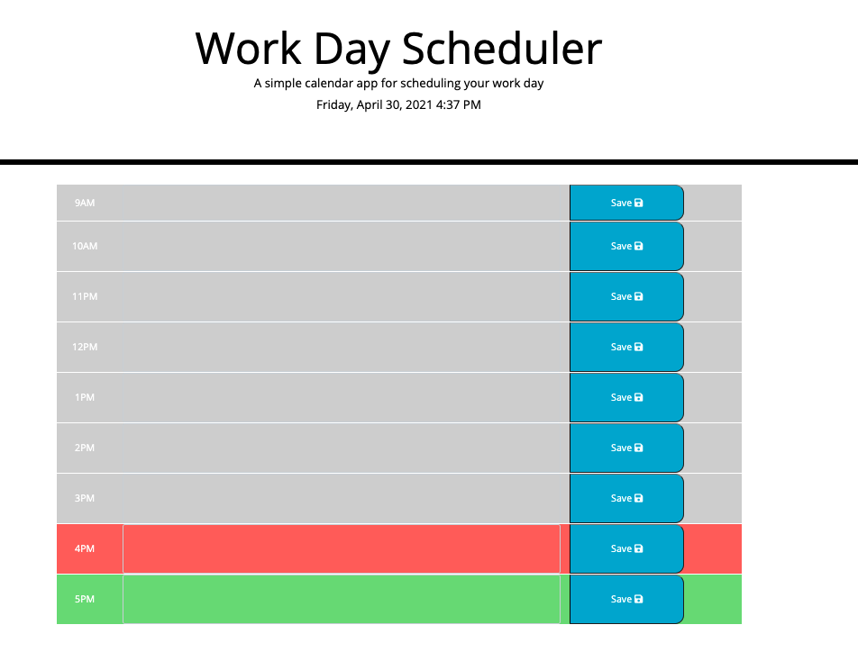

# HW05-Day-Planner

<h2>Description</h2>

* I was tasked with creating a calendar application that allows users to save events and appointments for each hour of the day. The app will run in the browser and feature dynamically updated HTML and CSS powered by jQuery.

* I utilized the moment.js library to work with the date and time functionality. 

* The user has a busy schedule and needs to add important appointments to the daily planner to better manage their time effectively.

<h2>Links</h2>

* Here is the link to the deployed project @ https://tylerhance.github.io/Work-Day-Planner/ 

